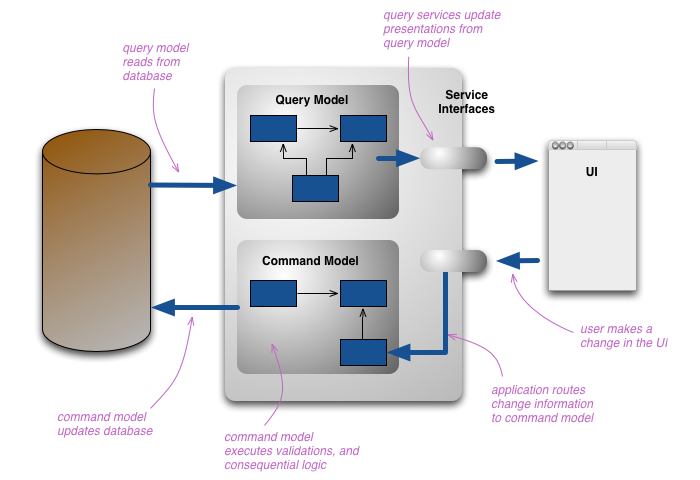
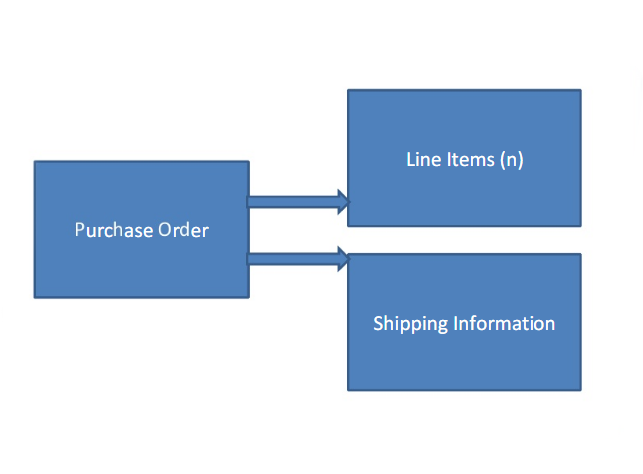
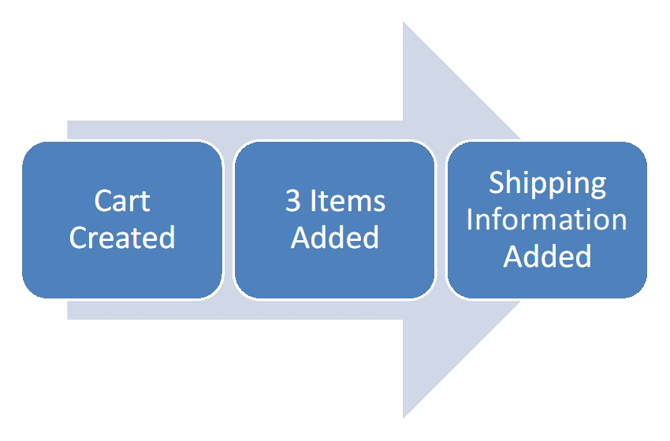
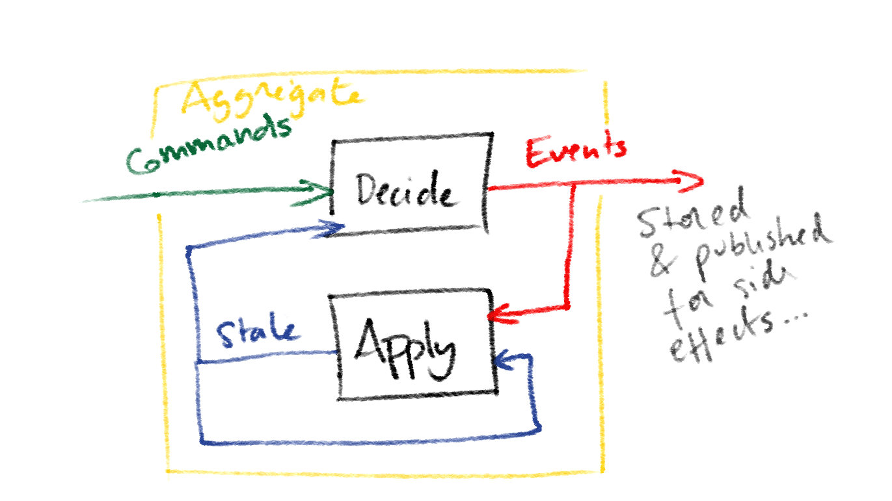
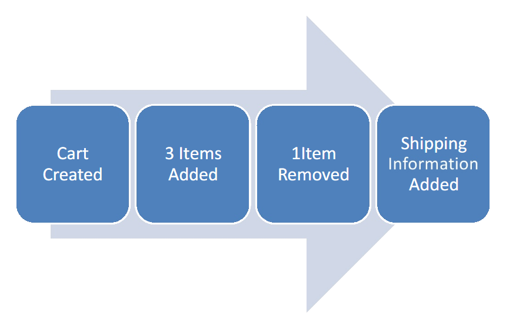
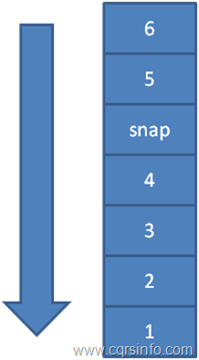
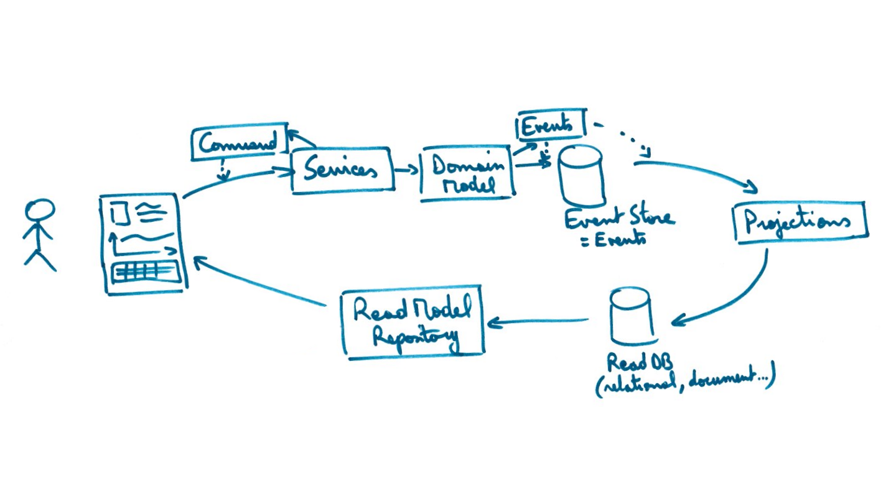
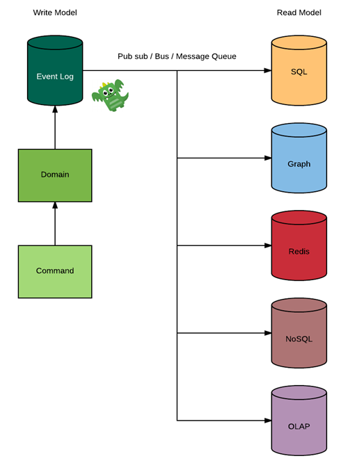

- title : Tacler la complexité avec Event Sourcing et CQRS
- description : Tacler la complexité avec Event Sourcing et CQRS
- author : Anthyme Caillard
- theme : Sky
- transition : default

***

## Tacler la complexité avec Event Sourcing et CQRS

---

## Visiteur, qui es-tu ?

- Qui connait Event Sourcing ?
- Qui connait CQRS ?
- Qui connait DDD ?

***


# CQRS

' Un modèle d'une simplicité incroyable
' On s'intesse à séparer la gestion des écriture et des lecture de notre système

---

## CQS

### Command Query Separation

- Command : effets de bord / pas de retour
- Query : retourne des données / pas d'effets de bord

```csharp
void OrderProduct(Product product);

ICollection<Products> GetAllProducts();
```

### Un suggestion plus qu'un principe 

Contre exemple : *Stack.Pop()*
' On s'intesse à séparer la gestion des écriture et des lecture de notre système 

---

## CQRS

Command Query Responsibility Segregation

- Une architecture pour l'écriture
- Une architecture pour la lecture

' Au niveau architecture, nos command se concentre sur gérer le business et les side effects
' Les query sont en charge de ramener le plus efficacement possible les données à l'utilisateur, chaque query pouvant se concentrer sur une vue 

---

## Models

```csharp
class Cart 
{
    public void AddProduct(ProductId productId) { }    
    public void RemoveProduct(ProductId productId) { }    
    public void Validate() { }

    private ICollection<Product> Products { get; set; }
    //...
}

public class ProductCartView
{
    public ProductId Id { get; }
    public string Name { get; }
    public int Quantity { get; }
}
```
' 99% des requête sont la lecture et pourtant on structure la base pour l'écriture 

---


## Architecture



' Un modele CQRS simple peut être aussi simple que d'avoir des tables SQL pour l'écriture et des view pour la lecture
' Queries is what you need to scale in most cases   )
' Car en général on est sur du 100 query par command voir 1000 queries par command 

***


 

# Event Sourcing

---

## Un peu d'histoire

- 2006 Introduction et formalisation du concept d'Event Sourcing par Greg young
- Des dizaine d'années avant : utilisation dans les mainframes

---


> State transsitions are an important part of our problem space and should be modeled within our domain

' On s'intéresse plus aux différente étapes plutôt qu'a l'état courant
' Déterministe et savoir à chaque instant ce qu'il s'est passé
' Etre capable d'analyser scientifiquement chaque instant
' Qui a un log d'audit ? Qui peut dire qu'ils sont corrects ? Tout ce qui est régulé a besoin de cela ou pour exister ou se fera fermer.
' Si vous commencez à modéliser votre audit plutôt que travailler sur l'état courant
' Aucune entreprises matures n'utilise l'état courant. Assurance, banque, finance, social
' Choix imposé aux développeurs par le business 

---


' Dans la vie réel: un journal de gestion comptable
' Qui a un compte bancaire ? Est-ce que vous pensez que le solde est un une colonne dans une table ?
' Une balance est une somme de toutes les transactions

Ce coté ensemble de transactions est applicable a toute sorte de business 

---

## Event structure

```csharp
class EventStorage
{
    public Guid EventId { get; }
    public Guid StreamId { get; }
    public DateTime Date { get; }
    public string EventType { get; }
    public string Payload { get; }
}
```

---




' Prenons un cas classique avec un panier de courses
' Qui a refactoré un domain ? Migration scripts etc
' Que se passe t'il si on a 2 versions qui tourne en même temps ?Est ce qu'il peuvent avoir une vue différente chacun ? 

---




' Event stream
' On peut retourner de ces faits et retourner vers la version structuré transcient, on peut la supprimer et la recréer   ) 

---


' Ce côté ensemble de transactions est applicable a toute sorte de business
' Il est illégale de faire des modification, en eventsourcing vous ne pouvez pas le faire. 

---

- decide: f(state, command) -> events
- apply:  f(state, event) -> state





' left fold of previous behaviors 

---




' Qui supprime ou update des données ?
' Vous pouvez dire que cette donnée n'aura pas de valeur dans 1 an ? Dans 5 ans ?
' Vous avez fait ce choix ou vous n'y pensez même pas ? La donnée à beaucoup de valeur
' Projection a n'importe quel point dans l'existence du système, permet le voyage dans le temps
' Très sympa pour se remettre dans les conditions d'un bug et même créer un test automatisé 

---

## Performances

- Cout de stockage
- Vitesse d'execution

' Performances ?
' Ca doit être très gros ? Combien coutait un disque dur d'1to il y a 10 ans ? Aujourd'hui ? dans 3 ans ?
' Se soucier de supprimer les évènements ne fait pas sens
' Si vous n'avez pas une accumulation extrême et hors norme votre cout de stockage va diminuer de plus en plus avec le temps
' Et ca doit être lent ?
' Combien faites vous par jour ? 1 millions ? 10 millions ?  )
' Sur un ordinateur portable de ce type, on peut faire des les 20 000 opérations par seconde.  )
' Si vous faites le calcul c'est plus d'un milliard d'opération par seconde
' Et bien en fait c'est bien plus performant que beaucoup de modèles 

---


## Snapshot




' Tous les n events (500, 1000 ?) faire un snapshot
' Attention a l'obsolescence et la reconstruction des snapshots  )
' Vous avez fait ce choix ou vous n'y pensez même pas ? La donnée à beaucoup de valeur 


---


## Bonus

- Audit log
- Append only
- Immutable
- Scale
- Temporal queries
- Debbugging
- Securité (WORM)
- BDD : **Given** events **When** command **Then** events

' Tres simple a scaler car immutable
' Super user attack ? Il peut tout supprimer, il est root n'est pas ? Pas de problèmes 
' Write once read many (WORM) drive
' Les régulateurs vous aimerons si vous avez ce type d'approche 

***


' CQRS + ES 

# CQRS + ES !

---



' Vous pouvez faire du CQRS sans Event sourcing
' Mais vous ne pouvez quasiment pas faire de l' Event sourcing sans CQRS 

---

## Polyglot data



' Projections in the read module,
' La majorité des systèmes on besoin de plusieurs read models
' Un seul modèle ne peut convenir à tous les scénarios transactions, reporting, recherche, etc 

---


## Eventual consistency

> Most Bounded Contexts can interact withrelaxed consistency.

' Attention enventual != eventuel
' Consistance à terme
' Un choix business 

---

## Handle eventual consistency

- Notifier la GUI pour qu'elle se rafraichisse
- Faire des écrans de confirmation
- Désactiver en attendant la prise en compte
- Fake UI
- Commande validée -> Commande en cours de traitement


' Attention enventual != eventuel
' Consistance à terme
' Un choix business
' Idempotent
' 
' Déterministe et savoir à chaque instant ce qu'il s'est passé
' Etre capable d'analyser scientifiquement chaque instant
' Qui a un log d'audit ? Qui peut dire qu'ils sont corrects ? Tout ce qui est régulé a besoin de cela ou pour exister ou se fera fermer. 
' Command are hard to scale
' Queries are easy because we can use a relaxed consistancy
' Qui fait des queries complétement consistante ? Qui fait des pessimiste lock sur vos query aujourd'hui ? Et en fait vous êtes éventuellement consistant mais vous ne le savez pas
' Vous êtes déjà eventualy consistant mais vous n'en prenez pas avantage 


***

## Merci !

## Questions ?

@anthyme

anthyme@gmail.com


***
