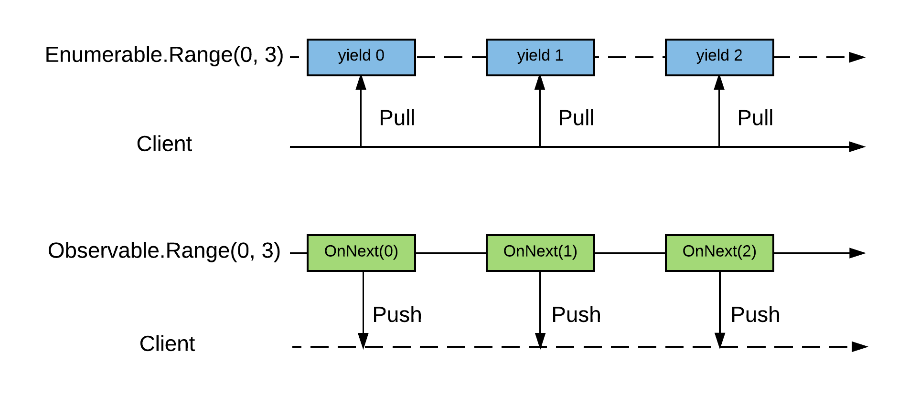

- title : Reactive Extensions
- description : Reactive Extensions
- author : Anthyme Caillard
- theme : Sky
- transition : default

***

# Reactive Extensions

---

## Visiteur, qui es-tu ?

- Qui connait async/await, Task ?
- Qui connait Observable ?
- Qui connait Rx ?

---

```csharp
button.Click += (s, args) => {
    if (something) {
        // raise another event
    }
}

button.Click -= /* ???? */

```

' Event based ?
' Not composable

---

# Comment baser son application sur un syst

***


# IEnumerable

# VS

# IObservable


---


```csharp
interface IEnumerable<out T> 
{
    IEnumerator<T> GetEnumerator();
}
```

```csharp
interface IEnumerator<in T> 
{
    void MoveNext();
    T Current { get; }
    void Reset();
}
```

---


```csharp
interface IObservable<out T> 
{
    IDisposable Subscribe(IObserver<T> observer);
}
```

```csharp
interface IObserver<in T> 
{
    void OnCompleted();
    void OnNext(T value);
    void OnError(Exception error);
}
```

---



---

```javascript
var mouseDown = draggable.toObservable("mousedown"),
    mouseMove = doc.toObservable("mousemove"), 
    mouseUp = doc.toObservable("mouseup");

var mouseMoves = mouseMove.Skip(1).Zip(mouseMove, (left, right) => {
        xChange: left.clientX - right.clientX,
        yChange: left.clientY - right.clientY
    });

var mouseDrags = mouseDown.SelectMany(md => mouseMoves.TakeUntil(mouseUp));

mouseDrags.Subscribe(evt => 
    draggable.css({
        left: draggable.offset().left + evt.xChange,
        top: draggable.offset().top + evt.yChange
    }));
```


***


## Reactive Extensions

---

> Rx is a library to create and compose event based asynchronous program with observables

---

### Primitives

```csharp
Observalbe.Empty<int>()     // OnCompleted

Observalbe.Return(42)       // OnNext

Observalbe.Throw<int>(ex)   // OnError

Observalbe.Never<int>()     // Nothing ...
```


***


sources
IEnumerable
event
subjet
async code

operator
throttle
interval
delay
buffer


reduce
filter,accumulate, aggregate, partition

map
select

combine
concatenate, merge, pair

control overflow

synchronisationContext


# Observable Observer

***


# MVI

## Model View Intent

---


***


### Plateformes

- Rx.Net
- RxJs
- RxJava
-


# Reactive Extensions based architecture

***
